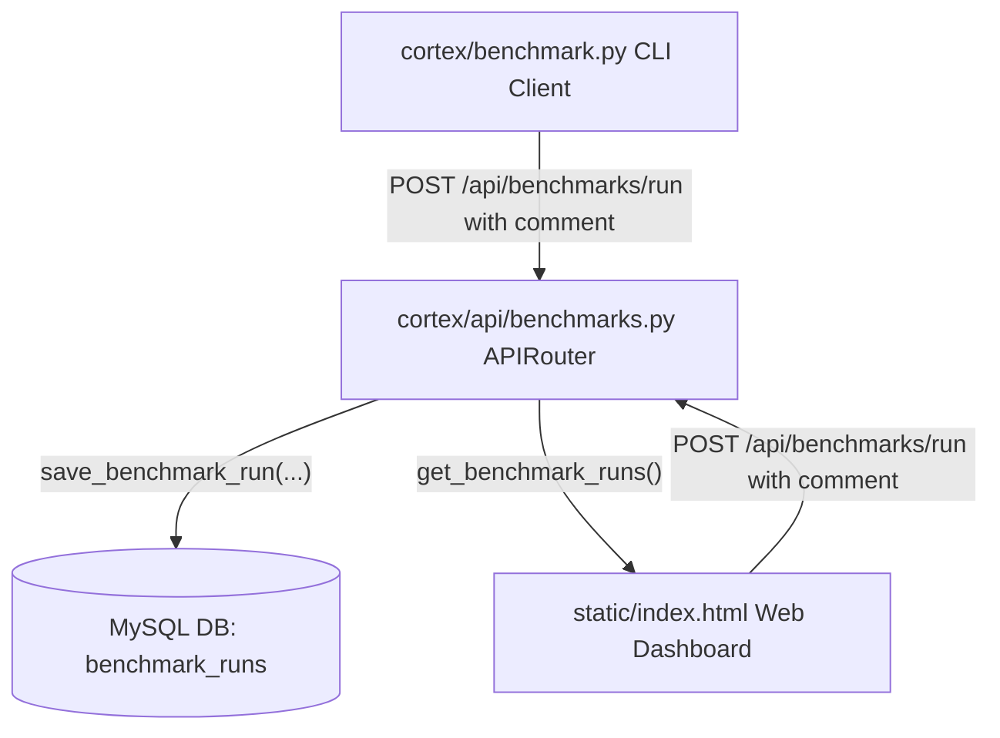

# RAG Benchmark Run Comments & Notes — Walkthrough

We have implemented a complete end-to-end full-stack feature allowing developers to record detailed comments and notes (e.g., documenting what code changes were made) for each RAG benchmark run. This streamlines developer workflows and provides historical context directly within the CLI and the Web Dashboard.

---

## 1. Feature Architecture

To support comments on benchmark runs, the feature spans all layers of our stack:



## 2. Key Implementations

### A. Database Layer
- **File:** [database.py](file:///Users/peterlee/git/chimera-cortex/cortex/core/database.py)
- **Modifications:**
  - Updated the standard table definition in `init_db()` to include the `comment TEXT` column.
  - Implemented an automatic `ALTER TABLE` statement on startup to safely migrate existing databases:
    ```python
    try:
        cursor.execute("ALTER TABLE benchmark_runs ADD COLUMN comment TEXT")
    except mysql.connector.Error as err:
        if err.errno != 1060:  # Ignore duplicate column name error
            raise err
    ```
  - Updated `save_benchmark_run(dataset_name, judge_model, total_questions, comment=None)` to persist the comments in MySQL.

### B. REST API Layer
- **File:** [benchmarks.py](file:///Users/peterlee/git/chimera-cortex/cortex/api/benchmarks.py)
- **Modifications:**
  - Extended the Pydantic `BenchmarkRunRequest` schema to support `comment: str = None`.
  - Updated the POST `/api/benchmarks/run` route to accept this comment and pass it down when saving the benchmark run.

### C. CLI Client Layer
- **File:** [benchmark.py](file:///Users/peterlee/git/chimera-cortex/benchmark.py)
- **Modifications:**
  - Added CLI options `--comment` / `-m` for easily annotating runs:
    ```bash
    python benchmark.py --comment "Phase 3 query decomposition fix"
    ```
  - Displayed the comment under active run statuses (`cmd_status`).
  - Added a beautifully formatted `Comment` column in historical runs table listing (`cmd_list`).

### D. Web Dashboard Layer
- **Files:** [index.html](file:///Users/peterlee/git/chimera-cortex/static/index.html), [style.css](file:///Users/peterlee/git/chimera-cortex/static/style.css), [app.js](file:///Users/peterlee/git/chimera-cortex/static/app.js)
- **Modifications:**
  - **Sidebar:** Added a text input field so developers can add descriptions before triggering a run from the browser.
  - **Run Detail Dashboard:** Added a premium glassmorphic `.run-comment-box` to show notes and code changes.
  - **Transitions:** Added custom animations (`fadeIn`) and state management to clear inputs and toggle the comments box on selection dynamically.

---

## 3. How to Use

### Via Command-Line Interface (CLI)
To run a benchmark with comments, simply use the `--comment` or `-m` flag:
```bash
python benchmark.py -m "Your description here"
```

To list historical runs including their notes:
```bash
python benchmark.py list
```

### Via Browser Dashboard
1. Select the **RAG Audit Suite** tab.
2. In the left panel, locate the **Run Comment / Changes** text field.
3. Input your description and click **Run Benchmark**.
4. The comment will be preserved and displayed in the main dashboard panel when clicking that run in the sidebar.
