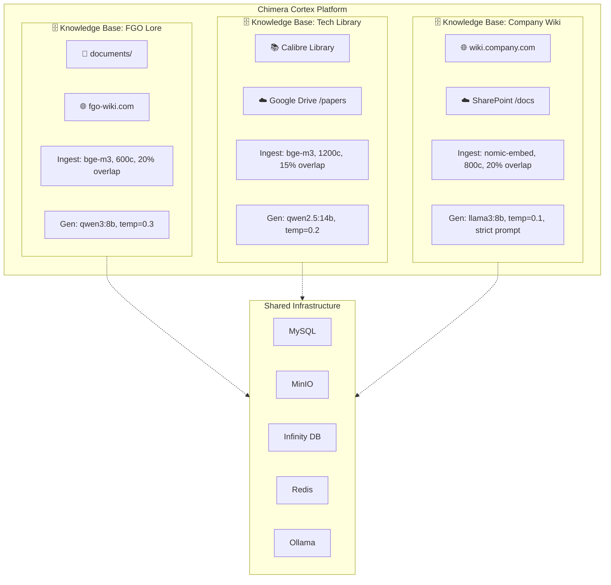
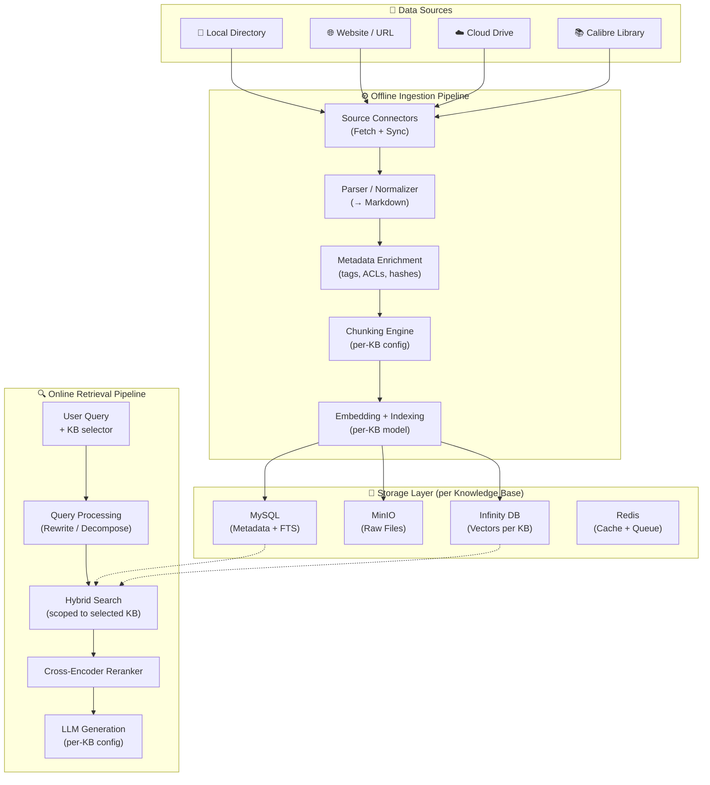
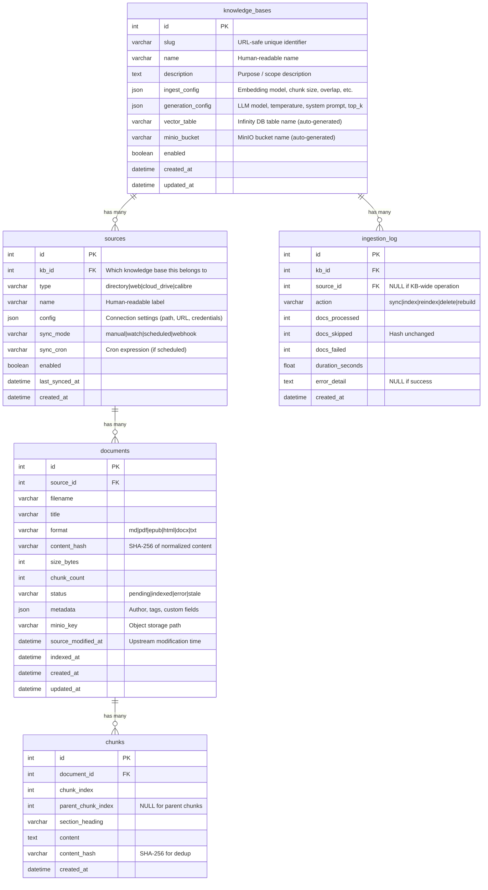
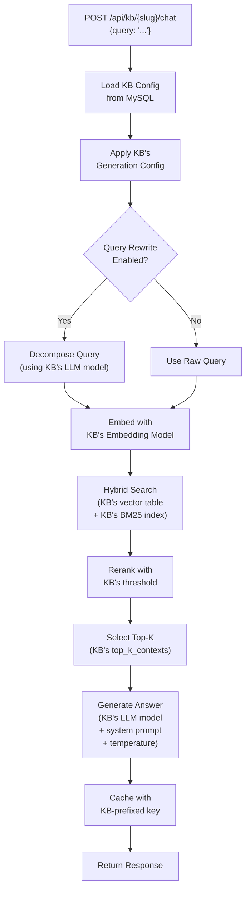
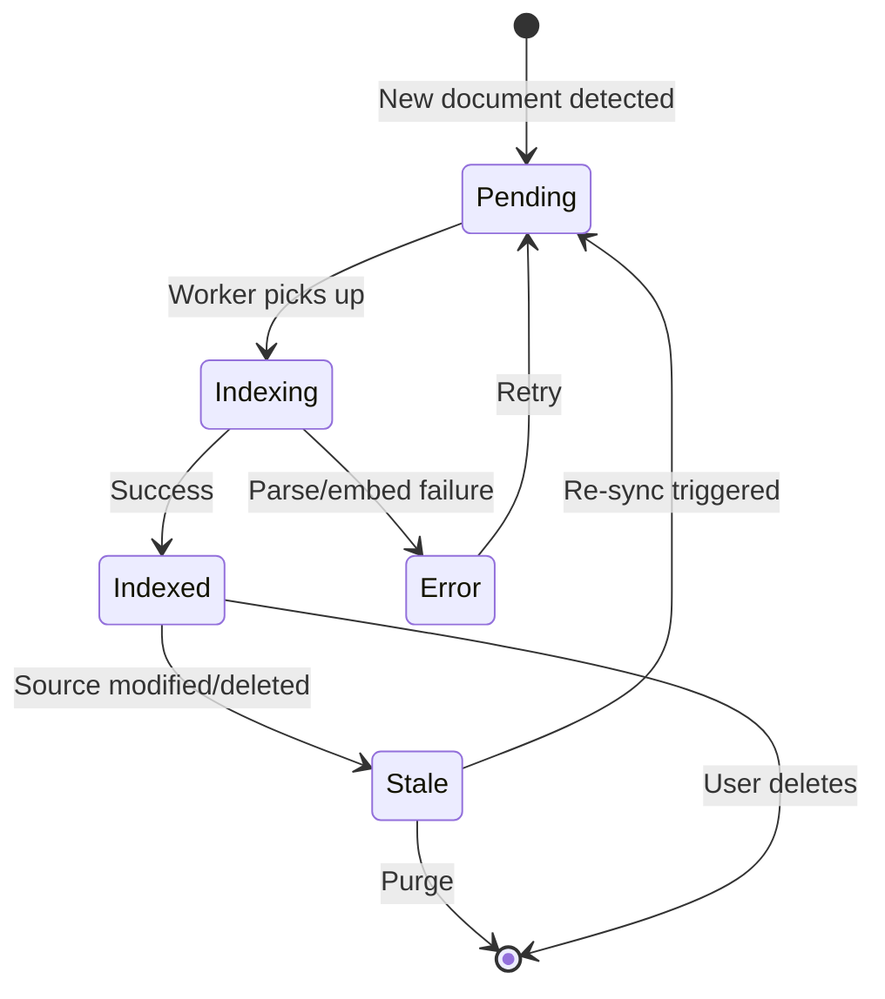
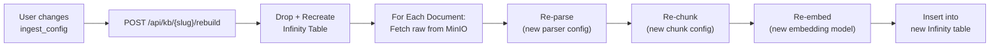

# Knowledge Database & Multi-Source Ingestion Architecture (2026)

## Executive Summary

This report designs a **multi-database knowledge platform** for Chimera Cortex. Each **knowledge base** is a self-contained unit with its own data sources, ingestion configuration (embedding model, chunk size, overlap), and generation configuration (LLM model, temperature, system prompt). A single Chimera Cortex instance can host many knowledge bases — each tailored to a different domain, team, or use case.

---

## 1. Architecture Overview

### 1.1 Multi-Database Concept

A **knowledge base** (database) is the top-level organizational entity. It groups:
- **Data sources** — where content comes from (directories, websites, cloud drives, Calibre libraries)
- **Ingestion config** — how content is processed (embedding model, chunk size, overlap)
- **Generation config** — how queries are answered (LLM model, temperature, system prompt, top-K)



### 1.2 Why Multiple Databases?

| Scenario | Single DB Problem | Multi-DB Solution |
|:--|:--|:--|
| Different domains (fiction vs. technical) | Irrelevant cross-domain retrieval pollutes results | Each domain is a separate, isolated knowledge base |
| Different accuracy needs | One system prompt / temperature doesn't fit all | Per-DB generation config tuned to the use case |
| Different document types | 800-char chunks work for lore but not for textbooks | Per-DB chunk size, overlap, embedding model |
| Team/project isolation | Everyone queries the same pool | Teams get their own knowledge base |
| A/B testing | Can't compare chunking strategies | Create two KBs from the same source with different configs |

### 1.3 Full System Architecture



---

## 2. Data Model

### 2.1 Entity Hierarchy

```
Platform
  └── Knowledge Base (database)        ← NEW top-level entity
        ├── Ingestion Config            ← Per-KB: embedding model, chunk size, overlap
        ├── Generation Config           ← Per-KB: LLM model, temperature, system prompt
        ├── Sources[]                   ← Multiple data sources per KB
        │     └── Documents[]           ← Documents from that source
        │           └── Chunks[]        ← Indexed chunks with vectors
        └── Ingestion Log[]            ← Audit trail
```

### 2.2 Database Schema



### 2.3 Knowledge Base Configuration

Each knowledge base carries two JSON config objects that control the entire pipeline:

#### Ingestion Config (`ingest_config`)

```json
{
  "embedding": {
    "model": "bge-m3:latest",
    "dimensions": 1024,
    "provider": "ollama"
  },
  "chunking": {
    "strategy": "markdown_aware",
    "max_chars": 600,
    "overlap_chars": 120,
    "parent_chunk_max_chars": 1600
  },
  "parsing": {
    "pdf_parser": "docling",
    "epub_parser": "ebooklib",
    "html_parser": "beautifulsoup",
    "ocr_enabled": false
  },
  "search": {
    "bm25_enabled": true,
    "initial_topn": 20,
    "rrf_k": 60
  }
}
```

#### Generation Config (`generation_config`)

```json
{
  "model": "qwen3:8b",
  "provider": "ollama",
  "temperature": 0.3,
  "top_k_contexts": 5,
  "max_tokens": 2048,
  "system_prompt": "You are a strict document AI assistant. Answer based ONLY on the provided context. If the context does not contain the answer, say so.",
  "query_rewrite": {
    "enabled": true,
    "decompose_threshold_words": 15
  },
  "reranker": {
    "enabled": true,
    "min_score_threshold": 0.65
  }
}
```

> [!TIP]
> **A/B Testing Pattern:** Create two knowledge bases pointing to the same data source but with different `ingest_config` (e.g., 600 vs. 1200 char chunks) or `generation_config` (e.g., different models). Run the benchmark against both to compare performance.

### 2.4 Configuration Examples

```json
[
  {
    "slug": "fgo-lore",
    "name": "FGO Servant Lore",
    "description": "Fate/Grand Order character lore and game mechanics",
    "ingest_config": {
      "embedding": { "model": "bge-m3:latest", "dimensions": 1024 },
      "chunking": { "max_chars": 600, "overlap_chars": 120 }
    },
    "generation_config": {
      "model": "qwen3:8b",
      "temperature": 0.3,
      "top_k_contexts": 5,
      "system_prompt": "You are an expert on Fate/Grand Order servant lore. Answer based ONLY on the provided documents."
    },
    "sources": [
      { "type": "directory", "name": "Lore Files", "config": { "path": "./documents", "glob_patterns": ["*.md"] }, "sync_mode": "watch" }
    ]
  },
  {
    "slug": "tech-library",
    "name": "Technical Reference Library",
    "description": "Programming books, papers, and technical documentation",
    "ingest_config": {
      "embedding": { "model": "bge-m3:latest", "dimensions": 1024 },
      "chunking": { "max_chars": 1200, "overlap_chars": 240 }
    },
    "generation_config": {
      "model": "qwen2.5:14b",
      "temperature": 0.2,
      "top_k_contexts": 5,
      "system_prompt": "You are a precise technical assistant. Cite specific sections when answering. If the provided documents don't cover the question, state that clearly."
    },
    "sources": [
      { "type": "calibre", "name": "Calibre Books", "config": { "library_path": "/CalibreLibrary", "tag_filter": ["programming"] }, "sync_mode": "manual" },
      { "type": "cloud_drive", "name": "Research Papers", "config": { "provider": "google_drive", "folder_id": "1ABC..." }, "sync_mode": "scheduled", "sync_cron": "0 */6 * * *" }
    ]
  }
]
```

---

## 3. Storage Isolation Strategy

Each knowledge base gets its own isolated storage namespace to prevent cross-contamination:

### 3.1 Vector Isolation (Infinity DB)

Each KB creates a **separate table** in Infinity DB, named from the slug:

```
Infinity DB: default_db
├── Table: chunks_fgo_lore          ← KB "fgo-lore"
│   └── vec: vector(1024, float)
├── Table: chunks_tech_library      ← KB "tech-library"
│   └── vec: vector(1024, float)
└── Table: chunks_company_wiki      ← KB "company-wiki"
    └── vec: vector(768, float)     ← Different embedding dimensions!
```

**Why per-table, not filter-based:**
- Different KBs may use different embedding models with different dimensions (bge-m3 = 1024d, nomic-embed = 768d)
- Table-level isolation is more performant than filter-based (no filter overhead per query)
- Dropping a KB cleanly deletes its table — no orphan vectors
- Each table can have its own index settings (HNSW params tuned to dataset size)

### 3.2 Object Storage Isolation (MinIO)

Each KB gets a **namespaced path** within MinIO:

```
MinIO Bucket: cortex-documents
├── fgo-lore/                       ← KB "fgo-lore"
│   ├── 001_Mash_Kyrielight_lore.md
│   └── 002_Altria_Pendragon_lore.md
├── tech-library/                   ← KB "tech-library"
│   ├── designing_data_intensive_apps.epub
│   └── arxiv_2401.12345.pdf
└── company-wiki/                   ← KB "company-wiki"
    ├── page_onboarding.md
    └── page_architecture.md
```

### 3.3 Cache Isolation (Redis)

Redis keys are prefixed with the KB slug:

```
rag_cache:fgo-lore:{query_hash}
rag_cache:tech-library:{query_hash}
ingestion_queue:fgo-lore
ingestion_queue:tech-library
```

### 3.4 Isolation Summary

| Layer | Isolation Method | Key Benefit |
|:--|:--|:--|
| **Vectors (Infinity)** | Separate table per KB | Supports different embedding dimensions |
| **Files (MinIO)** | Prefixed path per KB | Clean deletion, no cross-contamination |
| **Cache (Redis)** | Key prefix per KB | Independent cache invalidation |
| **Metadata (MySQL)** | `kb_id` FK on all tables | Single DB, relational integrity |

---

## 4. Query Flow with KB Selection

### 4.1 Chat API Enhancement

The query API now requires specifying which knowledge base to query:

```python
class ChatRequest(BaseModel):
    query: str
    kb_slug: str           # Which knowledge base to search
    # Optional overrides (for experimentation)
    top_k: int | None = None
    temperature: float | None = None
```

### 4.2 Query Processing Flow



### 4.3 Multi-KB Query (Future)

For advanced use cases, a single query could fan out to multiple knowledge bases:

```python
class MultiKBChatRequest(BaseModel):
    query: str
    kb_slugs: list[str]    # ["fgo-lore", "tech-library"]
    fusion_strategy: str = "rrf"  # How to merge results across KBs
```

> [!NOTE]
> **Multi-KB query is a future enhancement.** The initial implementation should focus on single-KB queries. Multi-KB requires careful handling of different embedding spaces, different LLM models, and result fusion — all of which add complexity.

---

## 5. REST API Design

All document and source operations are scoped under a knowledge base:

### 5.1 Knowledge Base Management

```
POST   /api/kb                          Create a new knowledge base
GET    /api/kb                          List all knowledge bases with stats
GET    /api/kb/{slug}                   Get KB details + source count + doc count
PUT    /api/kb/{slug}                   Update KB config (name, ingest, generation)
DELETE /api/kb/{slug}                   Delete KB + all sources + docs + vectors
POST   /api/kb/{slug}/rebuild           Force full re-index of all sources
```

### 5.2 Source Management (scoped to KB)

```
POST   /api/kb/{slug}/sources           Add a data source to this KB
GET    /api/kb/{slug}/sources           List sources for this KB
GET    /api/kb/{slug}/sources/{id}      Get source details
PUT    /api/kb/{slug}/sources/{id}      Update source configuration
DELETE /api/kb/{slug}/sources/{id}      Remove source + its documents
POST   /api/kb/{slug}/sources/{id}/sync Trigger manual sync
GET    /api/kb/{slug}/sources/{id}/sync/status  Get sync progress
```

### 5.3 Document Management (scoped to KB)

```
GET    /api/kb/{slug}/documents         List documents (filterable by source, status, format)
GET    /api/kb/{slug}/documents/{id}    Get document metadata + chunk count
GET    /api/kb/{slug}/documents/{id}/content   Get raw content from MinIO
DELETE /api/kb/{slug}/documents/{id}    Delete document + vectors + chunks
POST   /api/kb/{slug}/documents/{id}/reindex   Force re-chunk + re-embed
```

### 5.4 Chat (scoped to KB)

```
POST   /api/kb/{slug}/chat              Query this knowledge base
POST   /api/kb/{slug}/cache/clear       Clear cache for this KB only
```

### 5.5 Ingestion Log

```
GET    /api/kb/{slug}/log               Ingestion history for this KB
GET    /api/ingestion/log               Global ingestion history (all KBs)
GET    /api/ingestion/stats             Aggregate stats across all KBs
```

### 5.6 API Response Examples

**`GET /api/kb`** — List knowledge bases:

```json
{
  "knowledge_bases": [
    {
      "id": 1,
      "slug": "fgo-lore",
      "name": "FGO Servant Lore",
      "description": "Fate/Grand Order character lore and game mechanics",
      "enabled": true,
      "stats": {
        "source_count": 1,
        "document_count": 415,
        "chunk_count": 2847,
        "last_indexed_at": "2026-06-04T10:30:00Z"
      },
      "ingest_config": { "embedding": { "model": "bge-m3:latest" }, "chunking": { "max_chars": 600 } },
      "generation_config": { "model": "qwen3:8b", "temperature": 0.3 }
    },
    {
      "id": 2,
      "slug": "tech-library",
      "name": "Technical Reference Library",
      "enabled": true,
      "stats": {
        "source_count": 2,
        "document_count": 47,
        "chunk_count": 12340,
        "last_indexed_at": "2026-06-04T08:00:00Z"
      },
      "ingest_config": { "embedding": { "model": "bge-m3:latest" }, "chunking": { "max_chars": 1200 } },
      "generation_config": { "model": "qwen2.5:14b", "temperature": 0.2 }
    }
  ]
}
```

**`POST /api/kb`** — Create new knowledge base:

```json
{
  "slug": "company-wiki",
  "name": "Company Knowledge Base",
  "description": "Internal documentation and policies",
  "ingest_config": {
    "embedding": { "model": "bge-m3:latest", "dimensions": 1024, "provider": "ollama" },
    "chunking": { "strategy": "markdown_aware", "max_chars": 800, "overlap_chars": 160 },
    "search": { "bm25_enabled": true, "initial_topn": 20 }
  },
  "generation_config": {
    "model": "qwen3:8b",
    "provider": "ollama",
    "temperature": 0.1,
    "top_k_contexts": 5,
    "system_prompt": "You are a company assistant. Answer based ONLY on internal documents. Be precise and cite sources."
  }
}
```

---

## 6. Source Connectors

> [!NOTE]
> The connector designs below are unchanged from the previous version. The key difference is that every connector now receives a `kb_id` and uses the KB's `ingest_config` for chunking/embedding.

### 6.1 Local Directory Connector

| Attribute | Detail |
|:--|:--|
| **Trigger** | Filesystem watcher (`watchdog`) for real-time, or manual scan |
| **Sync strategy** | Compare file `mtime` + SHA-256 hash against `documents.content_hash` |
| **Supported formats** | `.md`, `.txt`, `.pdf`, `.epub`, `.html`, `.docx` |

```python
class DirectoryConnector(BaseConnector):
    def scan(self, source):
        path = source.config["path"]
        patterns = source.config.get("glob_patterns", ["*.md"])
        for pattern in patterns:
            for filepath in glob.glob(os.path.join(path, "**", pattern), recursive=True):
                yield self.make_raw_document(filepath, source)
```

### 6.2 Website Connector

| Attribute | Detail |
|:--|:--|
| **Tool** | `crawl4ai` (open-source, local, Playwright-based) |
| **Trigger** | Scheduled (cron) or manual |
| **Output** | Clean Markdown with metadata (URL, title, crawl depth) |

### 6.3 Cloud Drive Connector

| Provider | SDK | Change Detection |
|:--|:--|:--|
| Google Drive | `google-api-python-client` | `changes.list()` with page token |
| OneDrive | `msgraph-sdk-python` | `delta` endpoint |
| Dropbox | `dropbox` | `list_folder/continue` with cursor |

### 6.4 Calibre Ebook Library Connector

| Attribute | Detail |
|:--|:--|
| **Interface** | Direct SQLite read from `metadata.db` |
| **Formats** | EPUB → `ebooklib`, PDF → `PyMuPDF`/`Docling`, TXT → direct |
| **Metadata** | Title, authors, tags, series, publisher, ISBN — all injected into chunks |

> [!WARNING]
> **Calibre concurrent access:** Always use `?mode=ro` when opening `metadata.db` to avoid conflicts with the Calibre GUI.

---

## 7. Parser / Normalizer Layer

All connectors normalize to **Markdown** using the KB's configured parsers:

| Format | Primary Tool | Fallback |
|:--|:--|:--|
| **Markdown** | Pass-through | — |
| **Plain Text** | Pass-through + heading detection | — |
| **PDF** | **Docling** (IBM) | PyMuPDF → Marker-PDF |
| **EPUB** | **EbookLib** + BeautifulSoup | Calibre `ebook-convert` |
| **HTML** | **BeautifulSoup** / `html2text` | Crawl4AI output |
| **DOCX** | **python-docx** | Pandoc |

---

## 8. Incremental Sync & Deduplication

### 8.1 Content Hash Tracking

Every document stores a SHA-256 hash of its normalized Markdown. On re-sync:
1. If `content_hash` unchanged → skip (no re-embed)
2. If `content_hash` changed → re-chunk and re-embed only the affected document
3. If document removed from source → mark as `stale`, remove vectors

### 8.2 Cross-Source Deduplication

Within a single KB, if the same content appears from two sources (e.g., a PDF in both Google Drive and local directory), the hash check prevents double-indexing. The second document is linked to the first's chunks.

### 8.3 Document State Machine



---

## 9. Connector Interface

All connectors implement a common interface. The key addition is that `RawDocument` now carries `kb_id`:

```python
from abc import ABC, abstractmethod
from dataclasses import dataclass

@dataclass
class RawDocument:
    """Common intermediate representation from any connector."""
    kb_id: int                 # Which knowledge base this belongs to
    source_id: int
    source_type: str           # "directory" | "web" | "cloud_drive" | "calibre"
    origin_path: str           # Original path/URL/ID at the source
    filename: str
    title: str
    format: str                # "md" | "pdf" | "epub" | "html" | "docx" | "txt"
    raw_bytes: bytes
    content_markdown: str      # Normalized markdown text
    content_hash: str          # SHA-256 of content_markdown
    source_modified_at: float
    metadata: dict             # Source-specific metadata

class BaseConnector(ABC):
    @abstractmethod
    def scan(self, source) -> list[RawDocument]:
        """Full scan: return all documents from this source."""
        pass

    @abstractmethod
    def detect_changes(self, source, since: float) -> list[RawDocument]:
        """Incremental: return only changed documents since timestamp."""
        pass

    @abstractmethod
    def detect_deletions(self, source, known_paths: set) -> list[str]:
        """Return origin_paths that no longer exist at source."""
        pass
```

### Ingestion Worker

The ingestion worker uses the KB's config for all processing:

```python
class IngestionWorker:
    def process(self, doc: RawDocument):
        kb = self.load_kb(doc.kb_id)

        # 1. Check hash — skip if unchanged
        existing = self.find_by_hash(doc.content_hash, kb.id)
        if existing and existing.status == "indexed":
            return  # Skip, unchanged

        # 2. Store raw file in MinIO (KB-namespaced)
        minio_key = f"{kb.slug}/{doc.filename}"
        self.minio.put_object("cortex-documents", minio_key, doc.raw_bytes)

        # 3. Chunk using KB's config
        chunks = self.chunk(
            doc.content_markdown,
            max_chars=kb.ingest_config["chunking"]["max_chars"],
            overlap=kb.ingest_config["chunking"]["overlap_chars"]
        )

        # 4. Embed using KB's model
        embeddings = self.embed(
            [c.text for c in chunks],
            model=kb.ingest_config["embedding"]["model"]
        )

        # 5. Insert into KB's vector table
        self.infinity.insert(
            table=kb.vector_table,  # e.g., "chunks_fgo_lore"
            records=[{**c, "vec": e} for c, e in zip(chunks, embeddings)]
        )

        # 6. Update MySQL metadata
        self.update_document_status(doc, status="indexed", chunk_count=len(chunks))
```

---

## 10. KB Lifecycle Operations

### 10.1 Create Knowledge Base

When a new KB is created:
1. Insert row into `knowledge_bases` table
2. Create Infinity DB table: `chunks_{slug}` with vector dimensions from `ingest_config`
3. Create MinIO prefix: `cortex-documents/{slug}/`
4. Initialize Redis key namespace: `rag_cache:{slug}:*`

### 10.2 Delete Knowledge Base

When a KB is deleted (cascading cleanup):
1. Drop Infinity DB table: `chunks_{slug}`
2. Remove all MinIO objects under `cortex-documents/{slug}/`
3. Delete all Redis keys matching `rag_cache:{slug}:*` and `ingestion_queue:{slug}`
4. Cascade delete in MySQL: `knowledge_bases` → `sources` → `documents` → `chunks` → `ingestion_log`

### 10.3 Rebuild Knowledge Base

When `POST /api/kb/{slug}/rebuild` is called:
1. Drop and recreate the Infinity table (new schema if config changed)
2. For each document in the KB: re-parse raw file from MinIO → re-chunk → re-embed
3. This enables **non-destructive config changes** — change chunk size, embedding model, or overlap and rebuild without re-fetching from sources



> [!IMPORTANT]
> **This is why "store raw in MinIO" matters.** When you change chunking strategy or embedding model, you rebuild from stored raw files — no need to re-download from Google Drive or re-crawl websites.

---

## 11. Technology Stack

### 11.1 New Dependencies

| Component | Tool | Purpose |
|:--|:--|:--|
| **Filesystem watcher** | `watchdog` | Real-time directory monitoring |
| **Web crawler** | `crawl4ai` | Website-to-Markdown conversion |
| **EPUB parser** | `ebooklib` | EPUB text extraction |
| **HTML parser** | `beautifulsoup4` | HTML → text conversion |
| **PDF parser** | `docling` or `PyMuPDF` | PDF → Markdown with tables |
| **DOCX parser** | `python-docx` | Word document extraction |
| **Google Drive** | `google-api-python-client` | GDrive API access |
| **OneDrive** | `msgraph-sdk-python` | Microsoft Graph API |
| **Dropbox** | `dropbox` | Dropbox API access |
| **Scheduler** | `APScheduler` or system `cron` | Scheduled sync jobs |

### 11.2 Reusing Existing Infrastructure

| Component | Expanded Role |
|:--|:--|
| **MySQL** | KB registry, source configs, document metadata, ingestion logs, BM25 FTS |
| **MinIO** | Raw file storage namespaced per KB |
| **Infinity DB** | Vector tables per KB (different dimensions supported) |
| **Redis** | Per-KB cache + ingestion job queues |
| **Ollama** | Multiple embedding/generation models as configured per KB |

---

## 12. Implementation Roadmap

### Phase 1: Multi-DB Core + Directory Connector
> Foundation: `knowledge_bases` table, per-KB config, refactored ingestion

- Create `knowledge_bases` table with `ingest_config` and `generation_config`
- Add `kb_id` FK to `sources`, update `documents`/`chunks` queries
- Per-KB Infinity table creation/deletion
- Per-KB MinIO path namespacing
- Refactor `/api/chat` → `/api/kb/{slug}/chat` with per-KB model/prompt selection
- Implement `DirectoryConnector` with `watchdog`
- Build KB CRUD API (`/api/kb`)
- **Deliverable:** Existing FGO lore works as `fgo-lore` KB; can create a second empty KB with different config

### Phase 2: Web Connector + Scheduled Sync
> Website crawling + automated sync infrastructure

- Integrate `crawl4ai` for URL → Markdown
- Implement `WebConnector` with depth/domain filtering
- Add `APScheduler` for cron-based sync
- Build ingestion log and `/api/kb/{slug}/log` endpoints
- **Deliverable:** Crawl a documentation site into a separate KB

### Phase 3: Calibre Connector
> Ebook library integration

- Implement `CalibreConnector` with SQLite reader
- EPUB extraction via `ebooklib`, PDF via existing pipeline
- Map Calibre metadata into document metadata
- Tag-based book filtering
- **Deliverable:** Query against ebook library in its own KB

### Phase 4: Cloud Drive Connectors
> Google Drive, OneDrive, Dropbox

- OAuth2 / Service Account auth flows
- Incremental sync via provider change detection APIs
- **Deliverable:** Sync a cloud folder into a KB

### Phase 5: Management UI
> Admin interface for the multi-DB platform

- KB creation/editing wizard
- Per-KB dashboard: sources, documents, sync status, error logs
- Side-by-side KB comparison for A/B testing
- Global overview: all KBs, total docs, last activity

---

## 13. Key Best Practices

| Practice | Detail |
|:--|:--|
| **Store raw, process later** | Always save raw files in MinIO first. Rebuilds use stored files, never re-fetch |
| **Hash before embedding** | Content hash check is the cheapest way to skip unnecessary work |
| **Isolate by table, not filter** | Per-KB vector tables support different embedding dimensions and clean deletion |
| **Config is data, not code** | Chunk size, model, prompt are all in `knowledge_bases.ingest_config` / `generation_config` — changeable without deploy |
| **Rebuild ≠ re-fetch** | Changing chunk strategy triggers rebuild from MinIO, not re-crawl/re-download |
| **Fail gracefully** | One document failure never crashes a full sync — log, skip, continue |
| **Separate concerns** | Connector (fetch) → Parser (normalize) → Chunker → Embedder → Indexer — each independently testable |
