# State-of-the-Art RAG Document Chunking Algorithms (2026)

## Executive Summary

Document chunking — how you segment text before embedding and retrieval — is now recognized as **one of the most impactful architectural decisions** in a RAG pipeline, often more critical than the choice of embedding model. The field has evolved from simple fixed-size splitting to context-aware, multi-granularity, and late-interaction strategies that prioritize semantic integrity.

This report covers 7 major chunking strategies, hierarchical retrieval patterns, structure-aware techniques, evaluation metrics, and a practical decision framework.

---

## 1. Chunking Strategies: From Simple to State-of-the-Art

### 1.1 Fixed-Size (Token/Character) Splitting

| Attribute | Detail |
|:--|:--|
| **Mechanism** | Split text at fixed intervals (e.g., every 512 tokens) with optional overlap |
| **Complexity** | Trivial |
| **Best for** | Prototyping, logs, simple/uniform data |
| **Status** | ⚠️ Not recommended for production RAG |

Overlap of 10–20% was standard practice, but 2026 analyses suggest that with modern re-rankers, overlap provides minimal retrieval benefit while increasing indexing costs.

---

### 1.2 Recursive Character Splitting

| Attribute | Detail |
|:--|:--|
| **Mechanism** | Hierarchically splits on separators (`\n\n` → `\n` → `.` → ` `) to respect natural boundaries |
| **Complexity** | Low |
| **Best for** | General purpose, structured docs |
| **Status** | ✅ Industry-standard baseline (default in LangChain / LlamaIndex) |

> [!IMPORTANT]
> Benchmarks consistently show recursive character splitting at **~512 tokens** is the most reliable "safe" default, often outperforming fancier methods in general-purpose benchmarks when given a fair context budget.

**Key tip:** Count *tokens* (e.g., via `tiktoken`), not characters.

---

### 1.3 Semantic Chunking

| Attribute | Detail |
|:--|:--|
| **Mechanism** | Uses embedding cosine similarity between consecutive sentences to detect topic shifts |
| **Logic** | Statistical (cosine similarity thresholds) |
| **Cost** | Moderate (embedding each sentence) |
| **Best for** | Long-form prose, research papers, transcripts |

**How it works:**
1. Segment document into individual sentences
2. Embed each sentence into a vector
3. Compute cosine similarity between consecutive sentence embeddings
4. When similarity drops below threshold → create chunk boundary

> [!WARNING]
> **The Fragment Problem:** Naive semantic chunking often produces tiny, useless fragments averaging ~40 tokens (FloTorch 2026). You **must set a minimum chunk floor** (200–400 tokens) to ensure the LLM receives enough context.

---

### 1.4 Proposition Chunking (Dense-X Retrieval)

| Attribute | Detail |
|:--|:--|
| **Mechanism** | LLM decomposes documents into atomic, self-contained factual statements |
| **Origin** | Tencent & Carnegie Mellon University research |
| **Cost** | High (LLM calls during ingestion) |
| **Best for** | Fact-heavy corpora, complex entity queries |

**What is a Proposition?**
- **Atomic** — cannot be further split without losing meaning
- **Self-contained** — includes resolved pronouns and necessary context
- **Verifiable** — expresses a clear factual claim

**Workflow:**
1. **Proposition Generation:** LLM (e.g., GPT-4) decomposes passages into atomic propositions
2. **Quality Filtering:** Verify each proposition meets atomic/self-contained criteria
3. **Embedding & Indexing:** Embed propositions as retrieval units
4. **Retrieval:** Search proposition index for highly specific fact matches

**Advantages:**
- Eliminates "context dilution" (irrelevant text in large chunks)
- Higher density of relevant information per token
- Superior for queries targeting specific entities or relationships

**Disadvantages:**
- Expensive (LLM calls per document at ingestion time)
- Some teams fine-tune a smaller "Propositionizer" model for cost efficiency at scale

---

### 1.5 Late Chunking ⭐

| Attribute | Detail |
|:--|:--|
| **Mechanism** | Embeds entire document first via long-context model, then applies chunk boundaries to token-level embeddings |
| **Cost** | Lower than contextual retrieval (single embedding pass) |
| **Best for** | Large documents, speed-sensitive applications |
| **Status** | 🔥 Leading-edge approach in 2026 |

**How it works:**
1. Pass the **entire document** through a long-context embedding model
2. The model generates token-level embeddings with full bidirectional attention (cross-document context)
3. Apply chunking boundaries **after** encoding
4. Pool token embeddings within each boundary to create chunk vectors

> [!TIP]
> Late chunking is unique because every chunk's embedding is "aware" of the entire document — context is retained **implicitly** through model attention, with no extra LLM calls needed.

**Key advantage:** Highly efficient. One embedding pass preserves semantic relationships across the entire document without generative LLM overhead.

---

### 1.6 Contextual Retrieval (Anthropic)

| Attribute | Detail |
|:--|:--|
| **Mechanism** | Prepends LLM-generated contextual summary/metadata to each chunk before embedding |
| **Cost** | High (LLM call per chunk during ingestion) |
| **Best for** | High-precision enterprise RAG, fact-specific retrieval |

**How it works:**
1. Split document into chunks (using any base strategy)
2. For each chunk, call an LLM to generate a contextual blurb:
   - Document title, section headers, surrounding context summary
   - Key entities, dates, or metadata
3. Prepend this blurb to the chunk text
4. Embed and index the enriched chunk

**Context is retained explicitly** — each chunk literally contains text describing its place in the broader document.

---

### 1.7 Agentic Chunking (LLM-Based)

| Attribute | Detail |
|:--|:--|
| **Mechanism** | LLM reasons about document structure and content to make autonomous chunking decisions |
| **Logic** | Reasoning-based (human-like judgment) |
| **Cost** | Very high (full LLM reasoning per document) |
| **Best for** | Complex, multi-format, or highly structured documents (contracts, manuals) |

**How it works:**
- The LLM analyzes content, headers, and structure holistically
- Makes autonomous decisions on split points optimized for future retrieval
- Often generates labels, summaries, and metadata for each chunk ("study-note" style)

> [!NOTE]
> Agentic chunking is largely experimental and can be overkill for simple document sets. It shines for domain-specific documents where structure (like legal clauses or technical specifications) is as important as content.

---

## 2. Hierarchical Retrieval: Parent-Child Chunking

This is a widely-adopted **architectural pattern** (not a chunking algorithm per se) that can be combined with any of the above strategies.

```
┌─────────────────────────────────────────────────┐
│              Parent Chunk (~1000+ tokens)         │
│  ┌──────────┐  ┌──────────┐  ┌──────────┐       │
│  │  Child 1  │  │  Child 2  │  │  Child 3  │     │
│  │ ~200 tok  │  │ ~200 tok  │  │ ~200 tok  │     │
│  └──────────┘  └──────────┘  └──────────┘       │
└─────────────────────────────────────────────────┘
        ↑ Retrieved via vector search
                              ↓ Fed to LLM for generation
```

**How it works:**
1. Create **small child chunks** (~200 tokens) for high-precision vector retrieval
2. Map each child to a **larger parent chunk** (~1000+ tokens) containing full surrounding context
3. At query time: retrieve by child similarity → feed parent chunk to the LLM

**Why it works:** Small chunks give precise embedding matches; large chunks give the LLM enough context to generate accurate, grounded answers.

---

## 3. Structure-Aware Chunking

Modern pipelines treat documents as **hierarchical, logical entities** rather than flat text streams.

### 3.1 Core Principles
- **Atomic Preservation:** Tables, code blocks, and lists are never split mid-element
- **Hierarchical Metadata:** Chunks are enriched with location metadata (e.g., `Header > Subheader > Section`)
- **Content-Specific Routing:** Different content types (text, table, code) get specialized chunking logic

### 3.2 Tables
| Approach | When to Use |
|:--|:--|
| **Table-as-a-Chunk** | Table fits within token limits |
| **Header + Row Preservation** | Large tables → split by row, each row retains column headers |
| **Format Transformation** | Convert to JSON/CSV before embedding for better relational capture |

### 3.3 Code Blocks
- Keep code blocks **intact** to preserve syntactical flow
- Prioritize embedding function/class definitions with their docstrings
- Inject metadata: filename, language, function/class name

### 3.4 Multi-Modal Content
- Use Vision-Language Models (VLMs) to generate textual summaries of images/charts
- Build hybrid indices: text chunks + image captions + table summaries in unified vector space
- Use modality-aware routing to retrieve the right content type

---

## 4. Evaluation Metrics & Benchmarks

### 4.1 Intrinsic Chunk Quality Metrics

These measure chunk quality **without** running the full RAG pipeline:

| Metric | What It Measures |
|:--|:--|
| **Intrachunk Cohesion (ICC)** | How semantically self-contained a chunk is (single topic focus) |
| **References Completeness (RC)** | Whether the chunk retains necessary references/context |
| **Document Contextual Coherence (DCC)** | Alignment with the document's natural structure |
| **Block Integrity (BI)** | Whether logical units/procedural steps remain unbroken |
| **Size Compliance (SC)** | Whether chunks stay within specified token limits |

### 4.2 Downstream RAG Metrics

| Category | Metrics | Purpose |
|:--|:--|:--|
| **Retrieval** | Precision@K, Recall@K, MRR, NDCG | Quality of chunk retrieval and ranking |
| **Generation** | Faithfulness, Answer Relevancy | LLM answer accuracy using retrieved context |
| **Efficiency** | IoU (Intersection over Union) | Token efficiency — relevant vs. extraneous content |

### 4.3 Key Benchmark Findings

> [!IMPORTANT]
> **Fair comparisons matter.** Studies show that chunking strategies must be compared with equal **total context budgets** (e.g., 2000 tokens total), not equal numbers of chunks (*k*). Under fair conditions, simpler strategies often outperform complex ones.

- **Recursive character splitting** (512 tokens, 10–20% overlap) consistently provides the best balance of accuracy and groundedness across diverse datasets
- Advanced strategies (semantic, proposition) often suffer from fragmentation or high cost, leading to lower end-to-end performance in many *general* use cases
- Chunking configuration is **as critical as or more critical than** the choice of embedding model (NVIDIA benchmarks)

---

## 5. Strategy Comparison Matrix

| Strategy | Precision | Recall | Cost | Complexity | Best Domain |
|:--|:--|:--|:--|:--|:--|
| Fixed-Size | Low | Medium | Very Low | Trivial | Prototyping only |
| Recursive Character | Medium | High | Low | Low | General purpose ✅ |
| Semantic | Medium-High | High | Moderate | Medium | Narrative, prose |
| Proposition (Dense-X) | Very High | Medium | High | High | Fact-heavy, entity queries |
| Late Chunking | High | High | Low-Moderate | Medium-High | Large docs, speed-sensitive |
| Contextual Retrieval | Very High | High | High | Medium | Enterprise, fact-specific |
| Agentic | Very High | High | Very High | High | Complex structured docs |

---

## 6. Practical Decision Framework

```mermaid
flowchart TD
    A["Start: Choose Chunking Strategy"] --> B{"What is your\ndocument type?"}
    B -->|"General / Mixed"| C["Recursive Character\n(512 tokens)"]
    B -->|"Long-form Prose"| D["Semantic Chunking\n(min 200 tok floor)"]
    B -->|"Fact-heavy / Entities"| E["Proposition Chunking"]
    B -->|"Complex Structured\n(Legal, Technical)"| F["Agentic or\nStructure-Aware"]
    
    C --> G{"Retrieval precision\nsufficient?"}
    D --> G
    E --> G
    F --> G
    
    G -->|"Yes"| H["Add Cross-Encoder\nReranker ✅"]
    G -->|"No"| I{"Budget for\nLLM at ingestion?"}
    
    I -->|"Yes"| J["Contextual Retrieval\nor Parent-Child"]
    I -->|"No"| K["Late Chunking\n+ Parent-Child"]
    
    J --> H
    K --> H
```



### Step-by-Step Recommendation

1. **Start simple:** Recursive Character Splitting at 400–512 tokens
2. **Add hierarchy:** If precision is low → implement Parent-Child Chunking
3. **Upgrade for accuracy:** Budget available → Contextual Retrieval or Late Chunking
4. **Always re-rank:** A Cross-Encoder Reranker is considered mandatory for production RAG in 2026
5. **Evaluate continuously:** Use both intrinsic metrics (ICC, DCC) and downstream metrics (Recall@K, Faithfulness) on your actual query distribution

---

## 7. Key 2026 Best Practices

| Practice | Detail |
|:--|:--|
| **Count tokens, not characters** | Use `tiktoken` or equivalent tokenizer |
| **Set minimum chunk floors** | Especially for semantic chunking (≥200 tokens) |
| **Test overlap necessity** | Modern re-rankers may make overlap unnecessary |
| **Enrich with metadata** | Section titles, filenames, table headers — often higher ROI than model swaps |
| **Structure-aware parsing** | Respect headers, tables, lists as structural anchors |
| **Fair benchmarking** | Compare strategies at equal context budgets, not equal *k* |
| **Domain-specific selection** | No one-size-fits-all; benchmark on your own query distribution |
| **Hybrid search** | Combine vector similarity + BM25 keyword search for robust retrieval |

---

## References & Further Reading

- **Dense X Retrieval** — Tencent / Carnegie Mellon University (proposition-based retrieval)
- **Late Chunking** — Jina AI research (embed-first, chunk-later paradigm)
- **Contextual Retrieval** — Anthropic (enrichment-based approach)
- **FloTorch 2026** — Fragment problem analysis in semantic chunking
- **NVIDIA RAG Benchmarks** — Chunking configuration vs. embedding model impact
- LangChain / LlamaIndex documentation for implementation patterns
