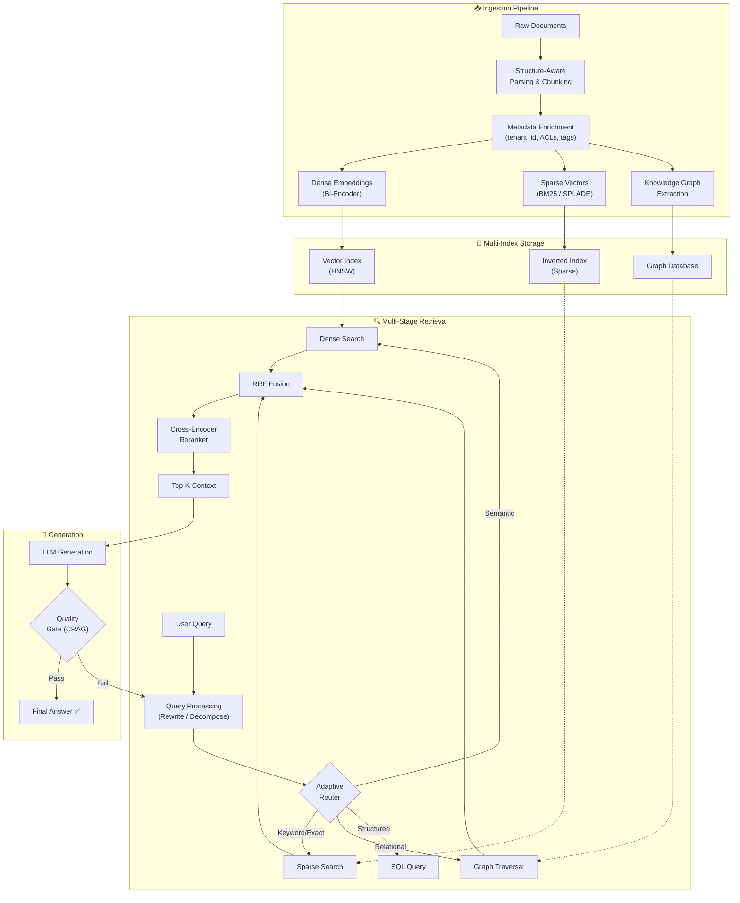
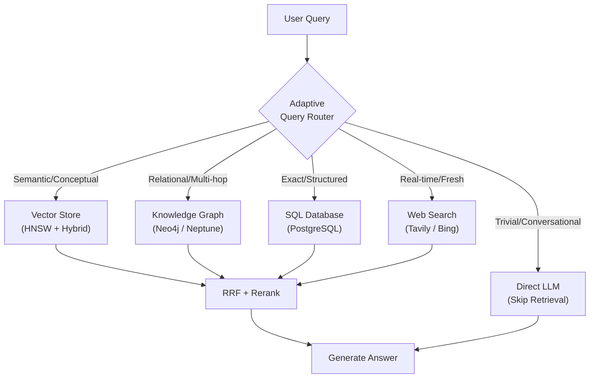
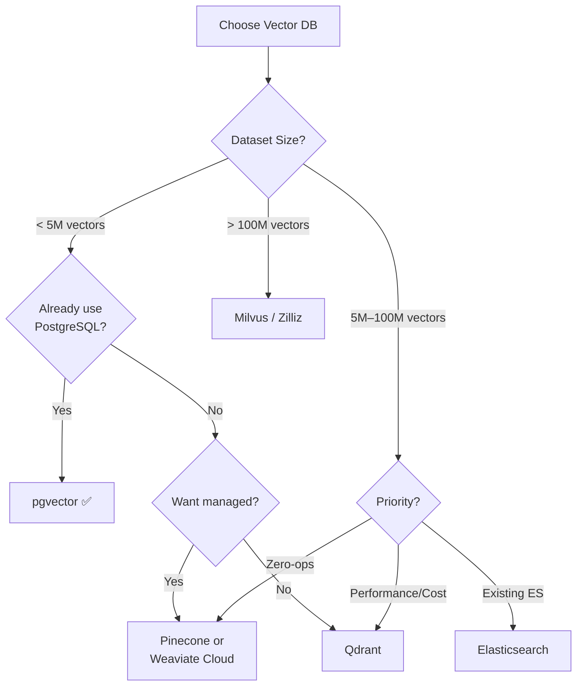
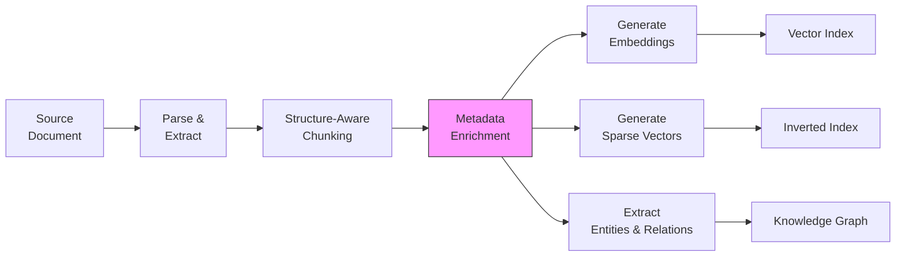
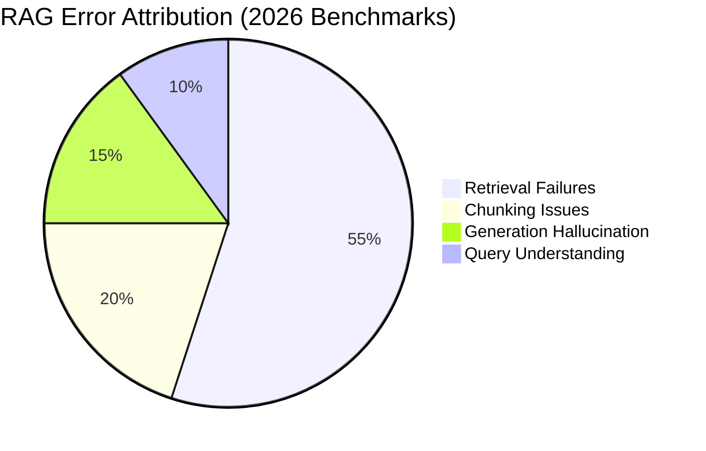
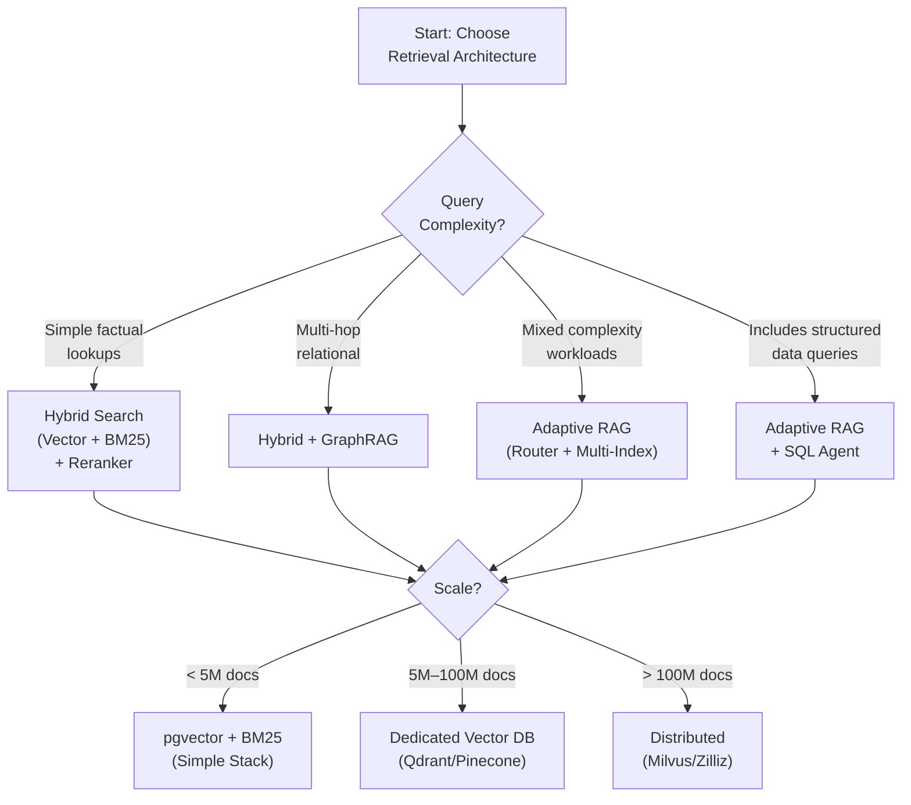

# State-of-the-Art RAG Document Indexing & Recall Architecture (2026)

## Executive Summary

Production RAG has evolved from flat "embed-and-search" pipelines into **modular, hybrid, multi-stage retrieval architectures**. The 2026 standard combines dense vector search, sparse lexical retrieval, knowledge graphs, and neural reranking in a composable funnel — orchestrated by adaptive, agentic routing that selects the optimal retrieval path per query.

The core principle: **retrieval is a funnel, not a single search.**

---

## 1. The Modern RAG Architecture: End-to-End



---

## 2. Indexing Layer: Multi-Representation Storage

Modern systems create **multiple representations** of the same document, each optimized for a different retrieval pattern.

### 2.1 Dense Vector Index (Semantic Search)

The backbone of semantic retrieval. Documents are embedded into dense vectors and searched via Approximate Nearest Neighbor (ANN).

#### Vector Index Algorithms

| Algorithm | Best For | Recall | Memory | Latency |
|:--|:--|:--|:--|:--|
| **HNSW** | Most RAG apps (≤100M vectors) | 95–99% | High (in-RAM graph) | Sub-millisecond |
| **IVF** | Massive datasets (100M+), cost-constrained | 85–95% (tunable) | Lower (cluster partitions) | Higher (depends on probes) |
| **Flat / Brute-Force** | Small datasets (≤100K), benchmarking | 100% (exact) | Proportional | Linear |

> [!TIP]
> **Start with HNSW** for its performance and ease of use. Switch to IVF only when dataset size or RAM cost explicitly demands it. For datasets under 5–10M vectors, **pgvector** in PostgreSQL avoids the operational overhead of a dedicated vector database.

#### Embedding Model Selection (2026)

| Model | Strength | Max Tokens | Use Case |
|:--|:--|:--|:--|
| **OpenAI `text-embedding-3-small`** | Cost/performance sweet spot | 8,191 | General English RAG |
| **OpenAI `text-embedding-3-large`** | Higher accuracy | 8,191 | When accuracy > cost |
| **Cohere `embed-v4`** | Multilingual leader | 128k | Multi-language corpora |
| **BGE-M3** | Open-source multilingual | 8,192 | Self-hosted, multilingual |
| **Voyage `voyage-3-large`** | Long-document specialist | 32,000 | Minimal-chunking pipelines |

> [!IMPORTANT]
> Never rely solely on public benchmarks (MTEB). Always evaluate models on **your domain-specific queries and data**. A model that tops a leaderboard may underperform on your corpus.

---

### 2.2 Sparse Index (Lexical / Keyword Search)

Captures exact-match signals that dense embeddings miss: product codes, error identifiers, proper nouns, technical terms.

| Method | Mechanism | Strengths | Infrastructure |
|:--|:--|:--|:--|
| **BM25** | Classic term-frequency weighting | Battle-tested, no training needed | Standard inverted index |
| **SPLADE** | Learned sparse expansion via MLM head | Solves vocabulary mismatch; expands with contextually relevant terms | Inverted index (same as BM25) |

**SPLADE vs. BM25:**
- BM25 only matches terms that literally appear in the document
- SPLADE **predicts and weights** semantically relevant terms (even if absent), bridging the vocabulary gap while maintaining inverted-index speed
- SPLADE is the preferred sparse method in 2026 production systems when training data is available

---

### 2.3 Knowledge Graph Index (GraphRAG)

For relational and multi-hop reasoning that flat vector search cannot capture.

**How it works:**
1. **Extraction:** LLMs parse documents to extract entities, relationships, and attributes
2. **Graph Construction:** Build a knowledge graph (nodes = entities, edges = relationships)
3. **Community Detection:** Hierarchical clustering creates community summaries for global queries
4. **Retrieval modes:**
   - **Local Search:** Entity-centric, k-hop neighborhood traversal for specific questions
   - **Global Search:** Map-reduce over community summaries for thematic/corpus-wide questions

| Query Type | Vector RAG | GraphRAG |
|:--|:--|:--|
| "What does doc X say about Y?" | ✅ Best fit | Overkill |
| "How does Entity A relate to Entity C?" | ❌ Misses relationships | ✅ Multi-hop traversal |
| "What are the main themes across all docs?" | ❌ No global view | ✅ Global search |
| "Compare X and Y across departments" | ⚠️ Partial | ✅ Structured relationships |

> [!NOTE]
> **LazyGraphRAG** (2026) defers summarization to query time, reducing indexing costs to ~0.1% of full GraphRAG while maintaining query-time accuracy for most use cases.

---

### 2.4 Structured Data Index (SQL/Tabular)

For queries requiring precise computation, aggregation, or filtering over structured data.

- Agent generates SQL or API calls based on user intent
- Results are injected into the LLM context alongside unstructured retrieval results
- Essential for questions like "What was revenue in Q3?" or "List all orders above $10K"

---

## 3. Retrieval Layer: The Multi-Stage Funnel

### 3.1 Stage 1: Broad Retrieval (High Recall)

**Goal:** Cast a wide net to capture all potentially relevant documents.

#### Hybrid Search (The 2026 Gold Standard)

Run dense and sparse searches **in parallel**, then fuse results:

```
┌──────────────────────────────────┐
│         User Query               │
│              │                   │
│    ┌─────────┼─────────┐        │
│    ▼                   ▼        │
│ Dense Vector       BM25/SPLADE  │
│  (Semantic)        (Lexical)    │
│    │                   │        │
│    └─────────┬─────────┘        │
│              ▼                  │
│     Reciprocal Rank Fusion      │
│         (k = 60)                │
│              │                  │
│              ▼                  │
│      Unified Candidate Set      │
│        (Top 20–50)              │
└──────────────────────────────────┘
```

**RRF Formula:**

$$\text{Score}(d) = \sum_{r \in R} \frac{1}{k + \text{rank}(r, d)}$$

**Why RRF over weighted score fusion:**
- Dense and sparse retrievers produce scores on **incompatible scales**
- RRF operates on **rank positions**, making it scale-invariant
- No parameter tuning needed (k=60 is universally effective)
- Documents consistently ranked high across both methods surface to the top

---

### 3.2 Stage 2: Neural Reranking (High Precision)

**Goal:** Compress the broad candidate set down to the most relevant 3–10 documents.

> [!IMPORTANT]
> **Reranking is the highest-ROI component in a RAG pipeline.** It converts high-recall, noisy results into high-precision, LLM-ready context. Skipping this step is the #1 cause of hallucination in production systems.

#### Reranker Comparison

| Reranker | Mechanism | Accuracy | Speed | Best For |
|:--|:--|:--|:--|:--|
| **Cross-Encoder** | Full token-level query×document interaction in single transformer pass | ⭐⭐⭐ Highest | Slow (cannot precompute) | Final reranking of top-K (<100) |
| **ColBERT (Late Interaction)** | Per-token embeddings with MaxSim scoring | ⭐⭐½ Near cross-encoder | Moderate (embeddings precomputable) | Larger candidate sets, resource-constrained |
| **Bi-Encoder + Cosine** | Independent query/doc embeddings | ⭐⭐ Good | Fast | First-stage retrieval only |

#### The "Search & Judge" Pattern

```
                     ┌─ Dense Search ──┐
User Query ──────────┤                 ├── RRF ── Top 50 ── Cross-Encoder ── Top 5 ── LLM
                     └─ Sparse Search ─┘
                     
                     ◄─── HIGH RECALL ──────►   ◄── HIGH PRECISION ──►
                         (Fast, Broad)              (Slow, Precise)
```

This is the **de facto production pattern** in 2026:
1. **Search** broadly (hybrid, 20–50 candidates) — optimize for recall
2. **Judge** precisely (cross-encoder, 3–10 final) — optimize for precision

---

### 3.3 Pre-Retrieval Filtering

**Apply metadata filters BEFORE vector search** to narrow the search space:

```python
# Pseudocode: Pre-retrieval filtering
results = vector_db.search(
    query_embedding=embed(query),
    filters={
        "tenant_id": current_user.tenant_id,     # Multi-tenancy
        "roles": {"$in": current_user.roles},     # RBAC
        "document_type": "technical_spec",         # Content type
        "created_after": "2025-01-01"             # Recency
    },
    top_k=50
)
```

> [!CAUTION]
> **Never rely on LLM system prompts for access control.** Prompt-based filtering is vulnerable to prompt injection and is considered a security anti-pattern. Always enforce filtering at the database query level.

---

## 4. Adaptive Multi-Index Routing

The 2026 standard is an **agent-as-librarian** pattern: the system selects which retrieval "shelf" to query based on the question.



### Routing Categories

| Query Type | Example | Routed To | Cost |
|:--|:--|:--|:--|
| **Trivial / Chitchat** | "Hello, how are you?" | Direct LLM (no retrieval) | Lowest |
| **Simple Factual** | "What's our refund policy?" | Hybrid Vector + BM25 | Low |
| **Entity/Keyword** | "Error code ERR-4502" | BM25/SPLADE (exact match) | Low |
| **Multi-hop / Relational** | "How does team A's work affect team B?" | GraphRAG | Medium |
| **Aggregation / Numeric** | "Total Q3 revenue by region" | SQL Database | Medium |
| **Complex / Research** | "Compare approaches X, Y, Z" | Decompose → Multi-index | High |
| **Real-time** | "Latest news on topic X" | Web Search | Medium |

**Enterprise benefit:** 30–60% cost reduction by routing simple queries to lightweight paths.

---

## 5. Multi-Tenancy & Security Architecture

### Isolation Patterns

| Pattern | Mechanism | Security | Cost | Best For |
|:--|:--|:--|:--|:--|
| **Silo** (Index-per-tenant) | Physical data separation | Maximum | Higher (dedicated infra) | Regulated industries |
| **Pool** (Shared index) | Logical isolation via metadata | High (if enforced at DB level) | Lower (shared infra) | SaaS platforms |

### Secure Indexing Checklist

1. **Ingestion:** Tag every chunk with `tenant_id`, `allowed_roles`, `document_scope` during creation
2. **Retrieval:** Inject mandatory filters at the database query layer (NOT in LLM prompts)
3. **Updates:** Event-driven permission refresh via webhooks when source ACLs change
4. **Audit:** Log all retrieval provenance — who accessed which document, when

---

## 6. Vector Database Landscape (2026)

| Database | Type | Hybrid Search | Strengths | Best For |
|:--|:--|:--|:--|:--|
| **Pinecone** | Managed | ✅ Native | Serverless, zero-ops | Teams wanting no infra management |
| **Weaviate** | Managed + Self-hosted | ✅ Native | Rich module ecosystem | Flexible deployment options |
| **Qdrant** | Self-hosted (cloud available) | ✅ Native | Performance, Rust-based | Control & cost optimization at scale |
| **Milvus** | Self-hosted (Zilliz cloud) | ✅ Native | Massive scale (billion+ vectors) | Large enterprise deployments |
| **pgvector** | Extension (PostgreSQL) | ⚠️ Manual BM25 | Transactional consistency, simple stack | ≤5–10M vectors, existing Postgres users |
| **Elasticsearch** | Self-hosted / Cloud | ✅ Native | Mature, full-text + vector | Teams already running ES |
| **ChromaDB** | Embedded | ❌ Limited | Simplicity, developer experience | Prototyping, small projects |

### Selection Decision Framework



---

## 7. Ingestion Pipeline: Indexing Best Practices

### 7.1 Real-Time vs. Batch Indexing

| Approach | Mechanism | Freshness | Best For |
|:--|:--|:--|:--|
| **Batch** (scheduled) | Periodic re-indexing (hourly/daily) | Hours-old data | Static corpora, documentation |
| **Event-Driven** (CDC) | Change Data Capture triggers re-indexing | Near real-time | Dynamic data, collaboration tools |
| **Streaming** | Continuous pipeline (Kafka/Pulsar) | Seconds-old data | Mission-critical freshness |

> [!IMPORTANT]
> **Nightly batch jobs are a "design failure" for dynamic data** in 2026. If your knowledge base changes frequently (tickets, wikis, emails), implement event-driven indexing to prevent stale context from causing hallucinations.

### 7.2 Indexing Workflow



**Key enrichment metadata per chunk:**
- `document_id`, `chunk_id`, `parent_chunk_id`
- `tenant_id`, `allowed_roles` (security)
- `document_type`, `section_header` (structure)
- `source_url`, `created_at`, `updated_at` (provenance)
- `page_number`, `file_name` (citation)

---

## 8. Evaluation: The RAG Triad

### 8.1 Retrieval Metrics

| Metric | What It Measures | When It Matters |
|:--|:--|:--|
| **Context Recall** | Are all necessary facts retrieved? | Silent failures — LLM generates plausible but wrong answers |
| **Context Precision** | Are the top-ranked results most relevant? | Reranker effectiveness |
| **MRR** (Mean Reciprocal Rank) | How high is the first relevant result? | User-facing search |
| **NDCG** | Quality-weighted ranking score | Graded relevance (not binary) |
| **Precision@K** | Proportion of relevant docs in top-K | Context window efficiency |

### 8.2 Generation Metrics

| Metric | What It Measures | Why It Matters |
|:--|:--|:--|
| **Faithfulness / Groundedness** | Is every claim supported by retrieved context? | #1 defense against hallucination |
| **Answer Relevance** | Does the answer address the question? | Prevents off-topic generation |

### 8.3 Operational Metrics

| Metric | What It Measures |
|:--|:--|
| **Latency (P50/P95/P99)** | End-to-end response time |
| **Cost per query** | LLM + embedding + search infrastructure |
| **Embedding drift** | Are embeddings still accurate as corpus evolves? |
| **Rewrite trigger rate** | How often does the agentic loop re-query? |

### 8.4 Where Most RAG Errors Originate



> [!IMPORTANT]
> **55% of RAG errors originate in the retrieval layer** (NVIDIA, FinanceBench, CRAG benchmarks). Improving your reranker or chunking strategy provides higher ROI than upgrading to a larger LLM.

---

## 9. Technique Comparison: Evolution from 2023 to 2026

| Dimension | Basic RAG (2023) | Advanced RAG (2024) | SOTA RAG (2026) |
|:--|:--|:--|:--|
| **Retrieval** | Single vector search | Hybrid (vector + BM25) | Multi-index (vector + sparse + graph + SQL) |
| **Indexing** | Batch (nightly) | Scheduled (hourly) | Event-driven / streaming |
| **Ranking** | Cosine similarity | RRF fusion | RRF + Cross-Encoder + ColBERT |
| **Orchestration** | Linear pipeline | Chain-based | Agentic (self-correcting loops) |
| **Structure** | Flat chunks | Parent-child hierarchy | Hierarchical + relational graph |
| **Security** | None / prompt-based | Basic metadata filters | Deterministic RBAC/ABAC at DB layer |
| **Evaluation** | Manual / vibes | Basic RAGAS | Continuous RAG Triad + CI/CD |

---

## 10. Practical Decision Framework

### Which Retrieval Architecture Do You Need?



### Implementation Checklist

| Phase | Action | Priority |
|:--|:--|:--|
| **1. Foundation** | Hybrid search (vector + BM25) with RRF | 🔴 Critical |
| **2. Precision** | Cross-encoder reranker on top-K | 🔴 Critical |
| **3. Security** | Metadata filters + pre-retrieval RBAC | 🔴 Critical |
| **4. Indexing** | Structure-aware chunking + metadata enrichment | 🟡 High |
| **5. Freshness** | Event-driven re-indexing for dynamic data | 🟡 High |
| **6. Routing** | Adaptive query router (skip retrieval for trivial queries) | 🟡 High |
| **7. Graph** | GraphRAG for relational/multi-hop queries | 🟢 When needed |
| **8. Observability** | Per-component metrics (retrieval, rerank, generation) | 🟡 High |
| **9. Evaluation** | Continuous RAGAS/DeepEval in CI/CD | 🟡 High |
| **10. Agentic** | Self-correcting retrieval loops (CRAG/Self-RAG) | 🟢 Advanced |

---

## References & Further Reading

- **HNSW** — Malkov & Yashunin, "Efficient and Robust Approximate Nearest Neighbor using Hierarchical Navigable Small World Graphs"
- **SPLADE** — Formal et al., "SPLADE: Sparse Lexical and Expansion Model for First Stage Ranking"
- **ColBERTv2** — Santhanam et al., "ColBERTv2: Effective and Efficient Retrieval via Lightweight Late Interaction"
- **GraphRAG** — Microsoft Research, "From Local to Global: A Graph RAG Approach"
- **LazyGraphRAG** — Microsoft Research (2025), cost-optimized deferred summarization
- **RRF** — Cormack et al., "Reciprocal Rank Fusion Outperforms Condorcet and Individual Rank Learning Methods"
- **Adaptive RAG** — Jeong et al., "Adaptive-RAG: Learning to Adapt Retrieval-Augmented LLMs"
- **RAGAS** — Es et al., evaluation framework for RAG pipelines
