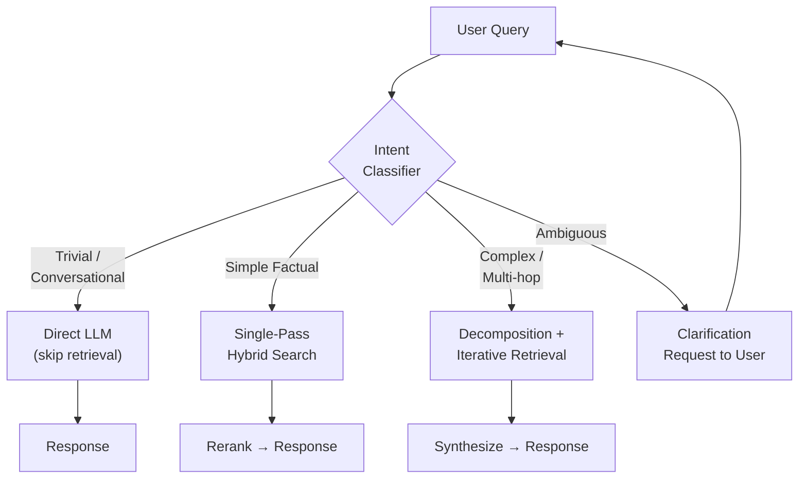
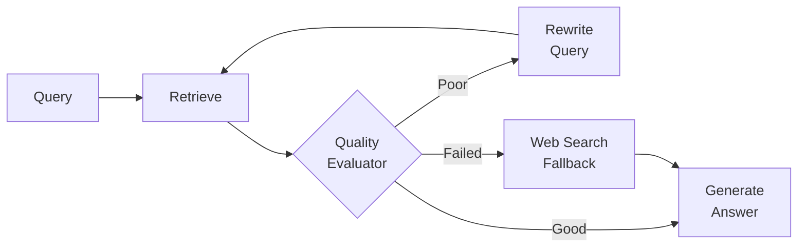
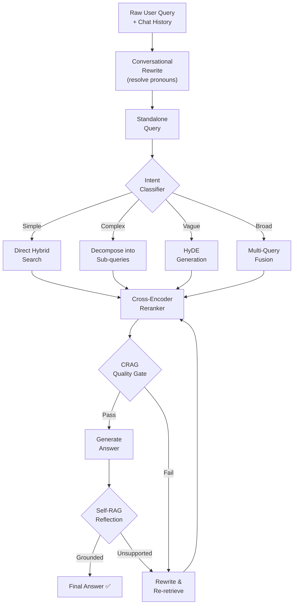
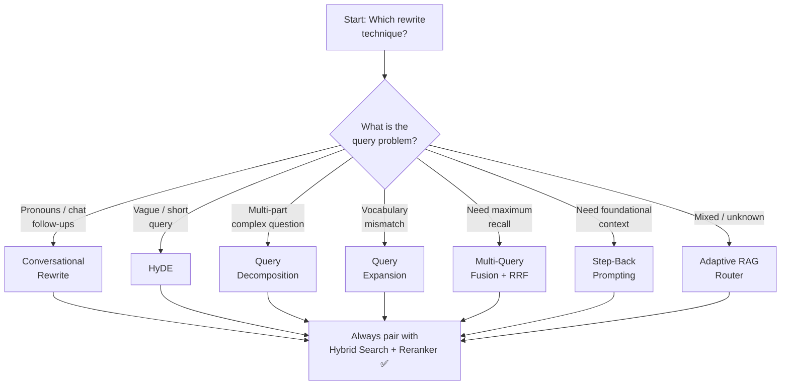

# State-of-the-Art RAG Query Rewrite Techniques (2026)

## Executive Summary

Query rewriting has evolved from simple paraphrasing into a sophisticated **query understanding layer** — an intelligent intermediary between raw user input and the retrieval system. Modern production pipelines employ a "multi-lens" approach where rewriting, decomposition, expansion, and routing are **selected dynamically** based on query intent and complexity.

The core insight: **the user's first draft is rarely the optimal search query.** State-of-the-art systems treat it as a starting point to be refined, analyzed, and decomposed.

---

## 1. Core Query Rewrite Techniques

### 1.1 Direct LLM Rewriting (Baseline)

| Attribute | Detail |
|:--|:--|
| **Mechanism** | LLM rephrases the user query into a more specific, search-optimized form |
| **Cost** | 1 LLM call |
| **Latency** | Low |
| **Best for** | Ambiguous, colloquial, or poorly-phrased queries |

**How it works:**
1. Pass the raw user query to an LLM with a system prompt:
   > *"Rewrite the following user question into a clear, specific search query optimized for retrieving relevant documents."*
2. Use the rewritten query for retrieval

**Example:**
```
Original:  "why does my code crash when I do the thing with the database"
Rewritten: "Python database connection error causes and troubleshooting"
```

> [!NOTE]
> This is the minimum viable query rewrite. Most production systems layer additional techniques on top.

---

### 1.2 Multi-Query Generation (RAG-Fusion)

| Attribute | Detail |
|:--|:--|
| **Mechanism** | LLM generates multiple diverse query variations; results are fused via Reciprocal Rank Fusion (RRF) |
| **Cost** | 1 LLM call + N parallel retrievals |
| **Latency** | Moderate (parallel retrieval helps) |
| **Best for** | Broad queries, ambiguous intent, maximizing recall |

**How it works:**
1. LLM generates 3–5 diverse reformulations of the original query from different perspectives
2. Each variation is used to perform a **separate retrieval**
3. Results are merged using **Reciprocal Rank Fusion (RRF)**

**RRF Formula:**

$$\text{Score}(d) = \sum_{r \in R} \frac{1}{k + \text{rank}(r, d)}$$

Where:
- `rank(r, d)` = position of document `d` in result list `r`
- `k` = smoothing constant (typically 60)

**Why it works:** Documents that consistently rank high across multiple query variations surface to the top, while noise from any single variation is dampened.

**Example:**
```
Original:  "benefits of microservices"
Variant 1: "advantages of microservices architecture over monolith"
Variant 2: "why companies migrate to microservices"
Variant 3: "microservices scalability and maintainability benefits"
→ Parallel retrieval → RRF merge → unified ranked results
```

---

### 1.3 Query Decomposition

| Attribute | Detail |
|:--|:--|
| **Mechanism** | LLM breaks a complex multi-part question into atomic sub-queries |
| **Cost** | 1 LLM call + N sequential/parallel retrievals |
| **Latency** | Higher (multiple retrieval steps) |
| **Best for** | Multi-hop questions, comparative queries, complex reasoning |

**How it works:**
1. LLM analyzes the original query and generates independent sub-questions
2. Each sub-question is used for separate retrieval
3. Results are synthesized into a comprehensive final response

**Variants:**

| Variant | Description |
|:--|:--|
| **Parallel decomposition** | Sub-queries are independent; retrieve all at once |
| **Sequential (Chain-of-Retrieval)** | Each sub-query builds on the answer of the previous one |
| **Self-Ask** | Model asks and answers follow-up questions to itself, building knowledge incrementally |

**Example:**
```
Original:  "Compare the performance and cost of PostgreSQL vs MongoDB for time-series data"
Sub-query 1: "PostgreSQL performance benchmarks for time-series data"
Sub-query 2: "MongoDB performance benchmarks for time-series data"
Sub-query 3: "PostgreSQL vs MongoDB hosting and licensing costs"
→ Retrieve separately → Synthesize comparison
```

---

### 1.4 HyDE (Hypothetical Document Embeddings) ⭐

| Attribute | Detail |
|:--|:--|
| **Mechanism** | LLM generates a hypothetical answer; that answer is embedded and used for retrieval |
| **Cost** | 1 LLM call + 1 embedding + retrieval |
| **Latency** | Moderate |
| **Best for** | Short/vague queries, domain-specific terminology gaps |

**How it works:**
1. User submits a query
2. LLM generates a **hypothetical document** — a plausible answer to the query
3. The hypothetical document is **embedded** into a vector
4. This vector is used for similarity search (instead of embedding the raw query)
5. Retrieved real documents are fed to the LLM for the final grounded answer

**Why it works:** The hypothetical answer is structurally similar to actual documents in the corpus, so its embedding aligns better in vector space than a short question would. This transforms **question→document** matching into **document→document** matching.

**Example:**
```
Query: "How does TCP handle packet loss?"

Hypothetical Doc: "TCP handles packet loss through a retransmission 
mechanism. When a sender does not receive an acknowledgment (ACK) 
within a timeout period, it retransmits the unacknowledged segment. 
TCP also uses selective acknowledgments (SACK) to identify specific 
missing segments..."

→ Embed this hypothetical doc → Search → Retrieve real documents
```

> [!WARNING]
> **Risk of hallucinated search terms:** If the LLM generates an inaccurate hypothetical document, it can lead retrieval astray. Prompt engineering and output filtering are essential safeguards.

---

### 1.5 Step-Back Prompting

| Attribute | Detail |
|:--|:--|
| **Mechanism** | LLM generates a broader, more abstract version of the query to retrieve foundational context |
| **Cost** | 1–2 LLM calls + retrieval |
| **Latency** | Moderate |
| **Best for** | Highly specific questions, first-principles reasoning |

**How it works:**
1. Instead of directly searching for the narrow question, the LLM "steps back" to generate a higher-level question
2. Retrieval is performed on the broader question first
3. The foundational context grounds the model before answering the specific question

**Example:**
```
Original:  "What is the mass of the Higgs boson in electron volts?"
Step-back: "What are the fundamental properties of the Higgs boson?"

Original:  "Why does React 19 break my useEffect cleanup?"
Step-back: "How did React 19 change the useEffect lifecycle behavior?"
```

**Why it works:** By anchoring in first principles, the model avoids hallucination on narrow details and reasons from a broader knowledge foundation.

---

### 1.6 Conversational Query Rewriting (Context Resolution)

| Attribute | Detail |
|:--|:--|
| **Mechanism** | LLM resolves pronouns, ellipsis, and references using chat history to create a standalone query |
| **Cost** | 1 LLM call |
| **Latency** | Low |
| **Best for** | Multi-turn conversational RAG |

**The problem:**
```
User: "Who is the CEO of Nvidia?"
Bot:  "Jensen Huang is the CEO of Nvidia."
User: "How old is he?"
                    ↑ "he" = ??? for the retriever
```

**How it works:**
1. Collect recent conversation history (typically last N turns or a summary)
2. Pass history + latest user message to an LLM with prompt:
   > *"Rewrite the user's follow-up question into a standalone question that captures all relevant context."*
3. Use the standalone query for retrieval

**Key sub-techniques:**

| Technique | Description |
|:--|:--|
| **Coreference Resolution** | Replace pronouns (*he, it, they*) with explicit entity names |
| **History Windowing** | Include only last N turns to manage context size |
| **History Summarization** | For long sessions, generate a summary instead of raw history |
| **Ellipsis Completion** | Fill in omitted words implied by conversational context |

**Result:** "How old is he?" → "How old is Jensen Huang, the CEO of Nvidia?"

---

### 1.7 Query Expansion

| Attribute | Detail |
|:--|:--|
| **Mechanism** | LLM enriches the query with semantically related terms, synonyms, or domain terminology |
| **Cost** | 1 LLM call |
| **Latency** | Low |
| **Best for** | Bridging vocabulary mismatch between user language and document terminology |

**How it works:**
- LLM adds context-aware synonyms, related concepts, or domain-specific terms
- Expanded query captures broader semantic surface area

**Example:**
```
Original:  "heart attack treatment"
Expanded:  "heart attack myocardial infarction treatment therapy 
            intervention angioplasty stent thrombolysis"
```

> [!WARNING]
> **Over-expansion trap:** Adding too many terms dilutes query focus and can degrade precision, especially in dense vector search. Keep expansions targeted and domain-relevant.

---

## 2. Agentic & Adaptive Techniques

### 2.1 Adaptive RAG (Intent-Based Routing) ⭐

The industry-standard architecture in 2026. A lightweight classifier at the pipeline entrance dynamically selects the appropriate processing path.



**Routing categories:**

| Category | Action | Latency | Cost |
|:--|:--|:--|:--|
| **Trivial** | Skip retrieval; answer from LLM knowledge | Lowest | Lowest |
| **Simple factual** | Single-pass hybrid search (vector + BM25) | Low | Low |
| **Complex / Multi-hop** | Decompose → iterative retrieval → synthesize | High | High |
| **Ambiguous** | Request clarification from user | — | — |

**Enterprise benefit:** 30–60% reduction in API costs and latency by bypassing expensive retrieval for simple queries.

---

### 2.2 Corrective RAG (CRAG)

| Attribute | Detail |
|:--|:--|
| **Mechanism** | Quality-control gate between retrieval and generation; rewrites query if retrieval quality is poor |
| **Focus** | Retrieval quality assurance |

**How it works:**
1. Retrieve documents using the initial query
2. A lightweight **retrieval evaluator** scores document quality (correct / ambiguous / incorrect)
3. **If correct:** Pass documents to generator
4. **If ambiguous/incorrect:**
   - Filter out low-quality documents
   - **Rewrite the query** and re-retrieve
   - Or fall back to **web search** as supplementary source



---

### 2.3 Self-RAG (Reflective Generation)

| Attribute | Detail |
|:--|:--|
| **Mechanism** | Model generates special reflection tokens to self-critique retrieval, relevance, and factuality |
| **Focus** | End-to-end quality through introspection |

**Reflection decisions at each step:**
1. **Should I retrieve?** (or answer from parametric memory)
2. **Are retrieved documents relevant?**
3. **Is my generated output supported by the evidence?**
4. **Is the final answer useful?**

> [!TIP]
> Self-RAG is particularly powerful for high-stakes domains (medical, legal, financial) where every claim must be traceable to evidence.

---

### 2.4 Iterative Retrieval & Query Refinement

| Attribute | Detail |
|:--|:--|
| **Mechanism** | Loop: retrieve → evaluate → refine query → re-retrieve until evidence is sufficient |
| **Best for** | Multi-hop questions where a single retrieval round is insufficient |

**How it works:**
1. Perform initial retrieval
2. Evaluate whether gathered evidence is sufficient
3. If insufficient:
   - Extract keywords/entities from partial results
   - Identify information gaps
   - **Refine/rewrite the query** targeting the gaps
   - Re-retrieve
4. Repeat until convergence or max iterations

---

## 3. Technique Comparison Matrix

| Technique | Precision | Recall | Cost | Latency | Complexity | Best Use Case |
|:--|:--|:--|:--|:--|:--|:--|
| Direct LLM Rewrite | Medium | Medium | Low | Low | Low | Ambiguous/messy queries |
| Multi-Query (RAG-Fusion) | Medium | **High** | Moderate | Moderate | Medium | Broad queries, max recall |
| Query Decomposition | **High** | High | High | High | High | Multi-hop, comparative |
| HyDE | **High** | Medium-High | Moderate | Moderate | Medium | Vague queries, domain gaps |
| Step-Back Prompting | High | Medium | Low-Moderate | Moderate | Low | Specific detail queries |
| Conversational Rewrite | High | High | Low | Low | Low | Multi-turn chat |
| Query Expansion | Medium | **High** | Low | Low | Low | Vocabulary mismatch |
| Adaptive RAG (Routing) | **High** | High | **Optimized** | **Optimized** | High | Production systems |
| CRAG | **High** | High | Variable | Variable | Medium | Quality-critical systems |
| Self-RAG | **Very High** | High | High | High | High | High-stakes domains |
| Iterative Retrieval | **Very High** | **Very High** | High | High | High | Complex research queries |

---

## 4. Combining Techniques: Production Pipeline

State-of-the-art production systems **compose** these techniques rather than using them in isolation:



### Layer-by-Layer Architecture

| Layer | Technique | Purpose |
|:--|:--|:--|
| **1. Context Resolution** | Conversational Rewrite | Resolve pronouns/references from chat history |
| **2. Intent Analysis** | Adaptive Routing | Classify complexity; select optimal pipeline |
| **3. Query Transformation** | HyDE / Decomposition / Multi-Query / Step-Back | Transform query for optimal retrieval |
| **4. Retrieval** | Hybrid Search (Vector + BM25) | Cast the widest relevant net |
| **5. Reranking** | Cross-Encoder Reranker | Precision-rank the retrieved results |
| **6. Quality Gate** | CRAG | Evaluate retrieval quality; rewrite if needed |
| **7. Generation** | LLM | Generate grounded answer |
| **8. Reflection** | Self-RAG | Verify factual grounding before output |

---

## 5. Evaluation & Metrics

### 5.1 Component-Level Metrics (Query Rewrite Quality)

| Metric | What It Measures | How To Measure |
|:--|:--|:--|
| **Retrieval Impact** | Does the rewrite improve retrieval? | Compare Precision@K, Recall@K, NDCG, MRR of original vs. rewritten query |
| **Intent Preservation** | Does the rewrite maintain original meaning? | LLM-as-a-Judge scoring (1–5 scale) |
| **Query Naturalness** | Is the rewrite coherent (not keyword-stuffed)? | LLM-as-a-Judge or human eval |
| **Rewrite Trigger Rate** | How often does the rewriter activate? | Pipeline logging and correlation with outcomes |

### 5.2 End-to-End RAG Metrics

| Category | Metrics | Purpose |
|:--|:--|:--|
| **Retrieval** | Precision@K, Recall@K, MRR, NDCG | Quality of document retrieval |
| **Generation** | Faithfulness, Answer Relevancy | LLM answer accuracy and grounding |
| **System** | Latency, Cost per query, Hallucination rate | Operational performance |

### 5.3 Evaluation Best Practices

1. **Create a "Golden" evaluation dataset** — curate challenging queries (ambiguous, multi-intent, conversational, domain-specific) with ground-truth relevant documents
2. **Use LLM-as-a-Judge** — score rewrites on intent preservation, clarity, and searchability with a rubric
3. **A/B test in production** — serve original vs. rewritten queries to measure downstream impact
4. **Benchmark the failures you fear most** — ambiguous, messy, conversational inputs predict real-world success better than well-formed test questions

### 5.4 Recommended Frameworks

| Framework | Strength |
|:--|:--|
| **RAGAS** | Retrieval and generation quality metrics |
| **DeepEval** | Custom evaluators for individual pipeline components |
| **TruLens** | RAG Triad (Context Relevance, Faithfulness, Answer Relevance) |
| **Braintrust / Arize Phoenix / LangSmith** | Full pipeline observability, traces, and comparative analysis |

---

## 6. Key 2026 Best Practices

| Practice | Detail |
|:--|:--|
| **Don't over-expand** | Too many added terms dilutes vector search precision |
| **Pair with hybrid search** | Rewrites steer dense vector search; BM25 catches exact keywords/names |
| **Always rerank** | Cross-Encoder Reranker is mandatory after retrieval in production |
| **Route before rewriting** | Classify intent first; apply expensive rewrites only when needed |
| **Monitor for hallucinated rewrites** | Rewriters can introduce terms not in the original intent |
| **Evaluate continuously** | Use RAGAS/DeepEval to track whether rewrites actually improve retrieval |
| **Handle ambiguity explicitly** | When intent is unclear, ask the user — don't guess |
| **Context caching** | Cache rewrite results for repetitive queries to reduce latency/cost |
| **Combine techniques** | Production systems layer multiple techniques (conversational → routing → transform → CRAG) |

---

## 7. Practical Decision Framework



### Quick-Start Recommendation

1. **Start with Conversational Rewrite** — handle the most common failure mode (context-dependent follow-ups)
2. **Add Adaptive Routing** — classify queries to avoid unnecessary computation
3. **Layer in HyDE or Multi-Query** for specific query types where baseline retrieval underperforms
4. **Add CRAG quality gate** — catch retrieval failures and auto-correct
5. **Measure everything** — use RAGAS to validate that each added layer actually improves your metrics

---

## References & Further Reading

- **HyDE** — Gao et al., "Precise Zero-Shot Dense Retrieval without Relevance Labels" (2022)
- **RAG-Fusion** — Multi-query generation with Reciprocal Rank Fusion
- **CRAG** — Yan et al., "Corrective Retrieval Augmented Generation" (2024)
- **Self-RAG** — Asai et al., "Self-Reflective Retrieval-Augmented Generation" (2023)
- **Step-Back Prompting** — Zheng et al., Google DeepMind (2023)
- **Adaptive RAG** — Jeong et al., "Adaptive-RAG: Learning to Adapt Retrieval-Augmented LLMs" (2024)
- **RAGAS** — Es et al., evaluation framework for RAG pipelines
